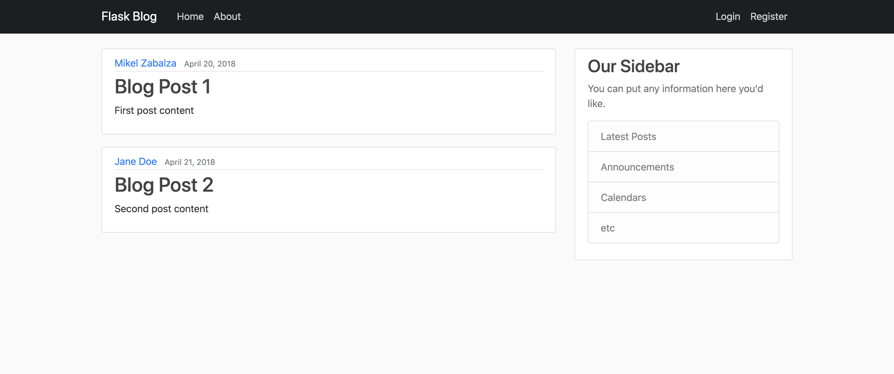

<h1 align="center">
	Flask blog
</h1>

<p align="center">
	<b><i>Development repo for blog project</i></b><br>
	Code devoleped following tutorial from Corey Schafer
    <a href="https://www.youtube.com/watch?v=MwZwr5Tvyxo&list=PL-osiE80TeTs4UjLw5MM6OjgkjFeUxCYH"><b>Full-Featured Web App</b></a>.
</p>

<p align="center">
	
	
	
	
	
</p>

<p align="center"></p>


<h3 align="center">
	<a href="#%EF%B8%8F-about">About</a>
	<span> · </span>
	<a href="#%EF%B8%8F-usage">Usage</a>
	<span> · </span>
	<a href="#-testing">Testing</a>
	<span> · </span>
	<a href="#-useful-links">Useful Links</a>
</h3>

---

## 🗣️ About
> _In this Python Flask Tutorial, we will be learning how to structure a web app using python Flask framework as backend api._


## 🛠️ Usage

### Requirements

The program is written in python language. Find all requirements in requirements.txt file at the root folder.

### Instructions

**2. Setup environment**
* (optinal) create a virtual environment before installing all required dependencies:
```shell
virtualenv env
source env/bin/activate
```

* Install dependecies
```shell
pip install -r requirements.txt
```

**2. Executing the program**

To execute the program, run:

```shell
python app.py
```

## 📋 Testing

(to be written)

## 📌 Useful Links

* [Original source code of the series](https://github.com/CoreyMSchafer/code_snippets/tree/master/Python/Flask_Blog)
* [Youtube tutorial for the project](https://www.youtube.com/watch?v=MwZwr5Tvyxo&list=PL-osiE80TeTs4UjLw5MM6OjgkjFeUxCYH)
* [harm-smits' 42 Docs - minishell](https://harm-smits.github.io/42docs/projects/minishell)
